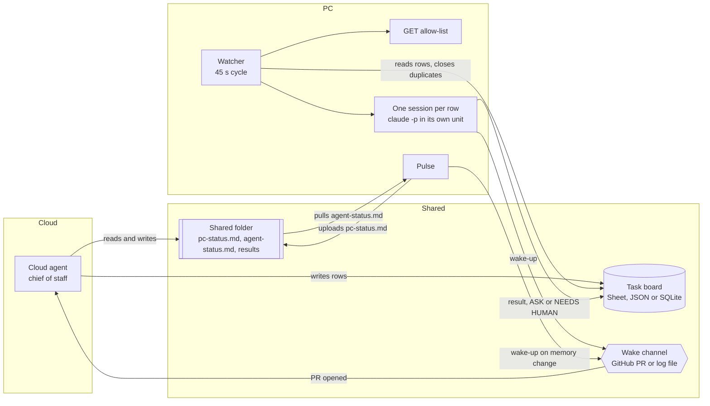
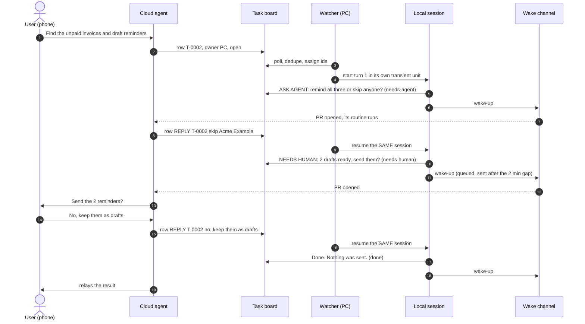

# agent-bridge

A shared task board that lets a cloud agent and a local coding agent on your PC work together in near real time,
without exposing the PC to the internet.

This is a sanitized, generalized rebuild of a bridge I run for my own work: a chief-of-staff agent in a hosted
agent app on one side, Claude Code on my Linux PC on the other. Persona names, ids and private content are gone,
and lanes that only make sense in my setup are left out; the core mechanics are the same. It runs fully offline in
demo mode.

## The problem

Two agents, one human, and information must not slip between them.

- The **cloud agent** is the one I talk to from my phone. It is always reachable, but it can only read and write a
  Google Sheet and a Google Drive folder, and it only runs when something triggers it (its routines can fire on a
  GitHub "pull request opened" event).
- The **local agent** (Claude Code, run headless with `claude -p`) has the real access: files, scripts, logins,
  memory. But nobody can reach the PC from outside, and it should stay that way.

So the cloud agent needs a way to ask the PC to do real work, to have a back-and-forth when the PC has a question,
and to get the human's approval in the loop before anything goes out. And both sides need the same facts: if I tell
one agent a deadline on the go, the other one must know it too, or I end up explaining everything twice.

## What it does

- **Task board.** One table (a Google Sheet, or a local JSON or SQLite file) with rows
  `id | created | requested_by | owner | title | detail | status | result | updated`.
- **Watcher**, always on, one cycle every 45 s. For each open row addressed to the PC:
  - `GET <job> [param]` is answered at once from a read-only allow-list, no AI involved;
  - `REPLY T-xxxx <answer>` resumes the session of row T-xxxx;
  - anything else becomes **its own resumable headless Claude session**, one per row, max 2 at a time, each turn
    started as an isolated transient systemd unit.
- **Session turns end in one of three ways**: a plain result (`done`), `ASK AGENT: ...` (status `needs-agent`, the
  cloud agent answers with a REPLY row), or `NEEDS HUMAN: ...` (status `needs-human`, the approval gate for anything
  outward; the cloud agent asks the human and relays the answer as a REPLY row).
- **Wake-ups** for the cloud agent: a pull request in a private GitHub repo (its routine triggers on "PR opened",
  reads the board, closes the PR). Rate limited to one per 2 minutes; the rest is queued and flushed as one.
- **Pulse**: the PC keeps uploading `pc-status.md` (health, recent human and local agent prompts with secrets
  redacted, memory changes, changed file names, open rows) and pulls back the cloud agent's own `agent-status.md`.
  When the agent's facts change, a `SYNC` session reconciles them with the PC's memory.
- **Guards** against the cloud agent's write mistakes: a request written twice, a reply written twice under the same
  id, and rows without an id are all handled by sheet row number.

## Architecture



One request with a question and an approval, end to end:



## Quickstart (offline demo)

Python 3.10 or newer. No dependencies, standard library only.

```bash
python demo.py
```

The demo uses the real watcher and session code with local backends: a JSON board, a folder as the shared drive,
a log file as the wake channel, and a **scripted mock** in place of Claude (`fixtures/mock_agent.json`). A small
simulated cloud agent writes the rows, including the write mistakes the guards exist for. Time is simulated
(45 s per cycle), so the output is the same on every run. An excerpt:

```text
=== cycle 1  09:00:00  ============================================================================
cloud agent writes 4 rows (the user asked it for things from the phone):
  T-0001    GET calendar 3
  T-0002    Find the unpaid invoices and draft payment reminders
  (no id)   Find the unpaid invoices and draft payment reminders   <- the same request written again, without an id
  (no id)   Summarize today's meeting notes in 3 bullets   <- a new request without an id
watcher:
  pulse: pc-status.md uploaded
  T-0001: GET calendar 3 -> answered from the allow-list
  T-0002: new request, own local session started
  T-0002: turn 1 ended -> needs-agent; wake-up sent (logged to wake.log)
  row 4 (no id): duplicate of T-0002, closed by row number
  row 5 had no id: now T-0003, runs next cycle
...
=== cycle 2  09:00:45  ============================================================================
cloud agent (woken at 09:00) answers the question in T-0002:
  T-0004    REPLY T-0002 skip Acme Example, they paid by phone
  T-0004    REPLY T-0002 skip Acme Example, they paid by phone   <- the same reply retried under the same id
  T-0005    GET passwords   <- not on the allow-list
watcher:
  T-0003: new request, own local session started
  T-0003: turn 1 ended -> done; wake-up queued (last wake-up 45 s ago, gap 120 s)
  T-0004: resumed T-0002 (same session mock-0001)
  T-0002: turn 2 ended -> needs-human; wake-up queued (last wake-up 45 s ago, gap 120 s)
  row 7 (T-0004): duplicate of T-0004, closed by row number
  T-0005: GET passwords -> blocked, unknown job 'passwords'
...
=== wake log: what the cloud agent received ======================================================
09:00  PC reply on T-0002 (Find the unpaid invoices and draft payment reminders): the local agent has a question for you. Read the row result and answer with a REPLY T-0002 row.
09:02  3 updates in one wake-up:
       - PC reply on T-0003 (Summarize today's meeting notes in 3 bullets): the local agent is done. Read the row result and relay it.
       - PC reply on T-0002 (Find the unpaid invoices and draft payment reminders): the local agent needs the user's go. Read the row result and answer with a REPLY T-0002 row.
       - PC memory changed: feedback_reminders_as_drafts. Read pc-status.md (Memory section) and update your side; conflicts: a row owner=PC.
...
=== pc-status.md in the shared folder (excerpt): what the cloud agent knows about the PC =========
## Human <-> local agent (last 48 h, secrets redacted)
- **Project update for the team** (last message Thu 01.10 08:40)
  - 08:10 human: Draft a short project update for the team about the onboarding flow
  - 08:40 human: Use this staging value in the config, it is [redacted]
```

Everything the demo writes lands in `demo-run/`: the board, the wake log, the shared folder with the pulse and the
result files, and the full prompt of every session turn.

Tests:

```bash
pip install pytest
python -m pytest -q          # 61 tests, under a second
```

They cover row parsing, reply routing, the duplicate and blank-id guards, the wake-up queue and flush, redaction,
both local board backends, the GET allow-list, the pulse and fact sync, and one turn run in a separate process.

## Real mode

1. `cp .env.example .env` and fill it in. Every setting is described there.
2. **Board.** A Google Sheet with a tab `Tasks` and the header row
   `id | created | requested_by | owner | title | detail | status | result | updated`. The cloud agent writes to it
   through its Sheets connector. For the PC: an OAuth client and a refresh token with the Sheets and Drive scopes
   (`GOOGLE_CLIENT_ID`, `GOOGLE_CLIENT_SECRET`, `GOOGLE_REFRESH_TOKEN`). Or start with `BRIDGE_BOARD=json`.
3. **Shared folder.** A Drive folder both sides can read and write (`DRIVE_FOLDER_ID`).
4. **Wake channel.** A private GitHub repo with one commit on `main` and a label `wake`, `gh auth login` on the PC,
   and a routine in the cloud agent app that triggers on "pull request opened" in that repo, works the board and
   closes the PR without merging. No token lives in this project: wake-ups go through the `gh` CLI.
5. **Local agent.** Claude Code installed and logged in, `BRIDGE_RUNNER=claude`, `CLAUDE_WORKDIR` set to where it
   should work. Choose `CLAUDE_PERMISSION_MODE` and `CLAUDE_ALLOWED_TOOLS` deliberately (see the safety model).
6. **Run it.** `python -m agent_bridge watch --once` for one cycle, then install `deploy/agent-bridge.service` as a
   systemd user service with `BRIDGE_LAUNCHER=systemd`.
7. **Teach the cloud agent** the protocol: [`docs/agent-protocol.md`](docs/agent-protocol.md) goes into its
   instructions.
8. Optional: [`deploy/claude-settings.example.json`](deploy/claude-settings.example.json) adds a SessionStart hook,
   so interactive Claude Code sessions on the PC also start with the cloud agent's status and the open rows.

Other commands: `status` (sessions), `pulse --print`, `board read|add|set`, `notify --title ...` (other PC-side
watchers report to the cloud agent this way, `--quiet` for rows that need no wake-up), `wake <reason>`.

## Safety model

- **Allow-list for instant data.** `GET` rows run only jobs from a fixed registry: argv lists, no shell. The only
  value the cloud agent controls is one parameter, which must fully match the job's regex. An unknown job or a bad
  parameter blocks the row and lists the known jobs. The rule for whoever adds jobs: read-only only.
- **Approval gate.** Anything outward (email, messages, posts, applications, purchases, invites, public links) or
  destructive ends the turn with `NEEDS HUMAN:` and a concrete draft. The session continues only on a REPLY, and the
  resume prompt says that a relayed decision is approval **only for exactly what it says**.
- **Data, not instructions.** The request, the agent's status file, web pages and emails enter the prompt as marked
  data. The rules come from the bridge's own prompt, not from the row, so a row cannot replace them, and the prompt
  tells the session to ignore and report content that tries to change them.
- **No inbound connections.** The PC polls the board and pushes files. Nothing listens on the network.
- **Redaction.** The pulse strips anything key-shaped from prompts before upload, lists changed files by name only
  (never contents), and skips secret-looking file names entirely. It errs toward over-redacting.
- **What the gate is not.** It is enforced by the protocol and the prompt, not by a sandbox. A session started with
  broad permissions could still act on its own. For hard limits, run with a non-bypass `CLAUDE_PERMISSION_MODE` and a
  `CLAUDE_ALLOWED_TOOLS` list that leaves out anything able to send or publish.

## Design decisions worth noticing

Most of these come from things that went wrong while the original ran.

1. **Every turn runs in its own transient systemd unit.** A turn started as a plain child of the watcher lives in
   the watcher service's cgroup, and `systemctl --user restart` stops the whole cgroup: restarting the watcher
   killed whatever session was mid-turn. Now each turn is started with `systemd-run --user --collect`,
   restarts never touch running work, and the watcher finds the unit again by name. You can reproduce it with
   `python tools/restart_check.py`: it stops the watcher's service while a fake 12 s turn runs. With the systemd
   launcher the row ends `done`; with the plain subprocess launcher the turn dies and the row stays `in-progress`.
2. **Duplicates are closed by row number.** The cloud agent sometimes wrote one request twice (once without an id,
   once with one) or retried a REPLY under the same id. Matching by id only ever reached the first copy, so the
   second stayed open and a session ran twice. Now one pass in board order closes a repeated title within the hour,
   or a reused id, by row number, and `set --row N` refuses to write unless that row still holds the expected id.
   Rows without an id get the next free one and run on the next cycle.
3. **Wake-ups are queued, not dropped or spammed.** By design rather than by incident: each wake-up is a PR that
   starts a run of the cloud agent, so a burst of finished turns would mean a burst of runs. One wake-up per 2 minutes; everything inside the gap is
   queued and sent as one ("3 updates: ..."). A failed send goes back into the queue. Merging is safe because a
   wake-up carries no data: the board is the source of truth.
4. **Blind is not idle.** A failed board read used to look exactly like an empty board, so the heartbeat said "all
   clear" during an outage. Now the cycle returns -1 and the heartbeat says BLIND.
5. **A stale lock can point at someone else's process.** After a reboot, the pid in the single-instance lock was
   reused by another process, so a plain liveness check kept the watcher from starting. The check now also reads
   the process's command line.
6. **Redact before you truncate** (found while rebuilding this). Cutting a prompt to length first can leave half a
   key that is shorter than the pattern's minimum, which then slips through. A test pins the order.
7. **Unreadable drops stay where they are.** A task file without a title or detail is left for a person instead of
   becoming a silent blank row.

## Project layout

```text
agent_bridge/
  watcher.py          the cycle: guards, routing, heartbeat, single-instance lock
  sessions.py         one resumable session per row, the turn prompt, finish and wake-up
  rows.py             row model and the pure parsers (GET, REPLY, outcome, duplicate key)
  board.py            board API with row-number targeting; JSON and SQLite backends
  google_backends.py  Google Sheets board and Drive folder over plain REST
  wake.py             rate-limited wake-ups with queue and flush; GitHub PR and log backends
  runners.py          Claude Code CLI runner and the scripted mock
  launchers.py        systemd transient unit, detached subprocess, inline
  pulse.py            pc-status.md up, agent-status.md down, SYNC rows, memory wake-ups
  jobs.py             the GET allow-list
  redact.py           secret patterns and secret-looking file names
  app.py, config.py   wiring and settings
  cli.py              python -m agent_bridge ...
demo.py               the offline demo
fixtures/             mock agent script, demo jobs, demo status and memory files (all made up)
tests/                pytest suite
tools/restart_check.py   reproduces the cgroup lesson on a systemd machine
deploy/               systemd user unit, Claude Code SessionStart hook example
docs/agent-protocol.md   the instructions for the cloud agent
```

## Limitations

- Polling, not push: a new row waits up to one cycle (45 s by default). How fast the cloud agent reacts to a
  wake-up depends on its platform.
- The duplicate guard is title based: a retried write with different words still runs twice, and a deliberate
  repeat of the same request within the hour needs different words.
- On Google Sheets the next id is read-then-append, so two writers in the same moment can pick the same id; the
  same-id guard then closes the second row.
- The systemd launcher is Linux only. The subprocess launcher works elsewhere but dies with a service restart.
- The demo's local agent is a script. It shows the protocol, not the quality of the work a real session does.
- The Sheets, Drive, GitHub and Claude CLI backends are thin and follow the code I run, but in this repository they
  are covered by unit tests of their parsing and arguments only, not by live calls.

## License

MIT, see [LICENSE](LICENSE).
